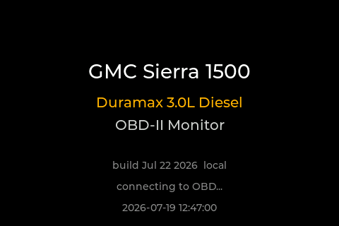
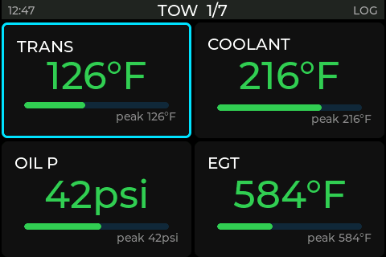
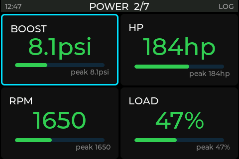
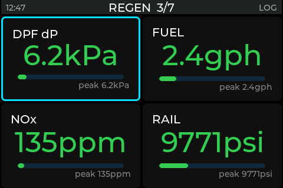
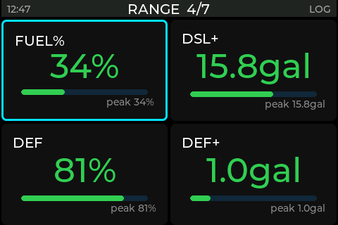
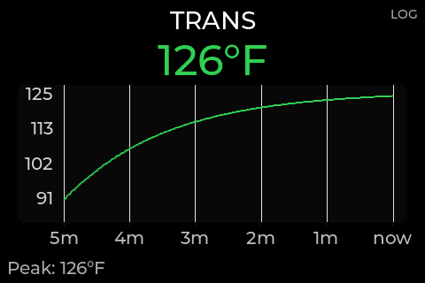
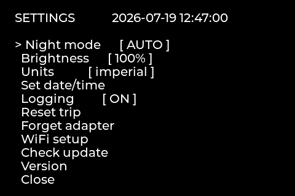
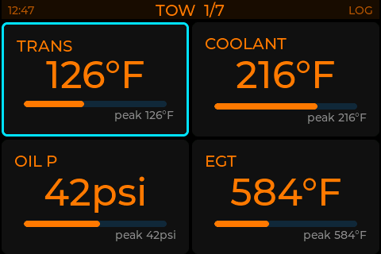
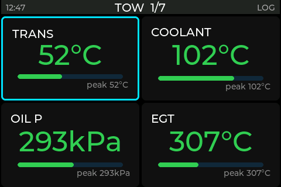

# GMC OBD Display — OTA Releases

Firmware release channel for an in-cab OBD-II stat display on a **2025 GMC Sierra 1500
3.0L Duramax** (LZ0, Global B). Binaries only — source is maintained privately.

The display shows live engine, transmission, aftertreatment and economy data pulled over
Bluetooth LE from a generic ELM327 adapter, including enhanced GM Mode-22 parameters
(transmission temperature, EGT, DPF differential pressure, fuel rail pressure, DEF level)
that generic scan tools do not expose.

## Hardware

| Part | Detail |
| :--- | :--- |
| **Display / MCU** | Elecrow **CrowPanel Advance 3.5"** — ESP32-S3-WROOM-1-N16R8 (16 MB flash, 8 MB PSRAM), 480×320 IPS |
| **Input** | Arduino **Modulino** rotary encoder (I²C) — rotate to move, press to zoom, long-press for settings |
| **Encoder cable** | **SparkFun Qwiic-to-Grove adapter cable, 100 mm** (`B082MM52ZR`) — the board exposes a Grove/Crowtail I²C port, the Modulino uses Qwiic; this bridges them |
| **Clock** | **PCF8563** real-time clock @ 0x51 + coin cell — timestamps the SD logs and drives automatic day/night theming |
| **Storage** | **microSD** card (FAT32) — 1 Hz CSV drive logs |
| **OBD adapter** | **Vgate vLinker MS** in BLE mode (classic-CAN ELM327) — see tested adapters below |
| **Power** | Truck USB (switched 5 V) → board USB-C |

The capacitive touch panel is present but unused; all navigation is via the encoder.

## Tested OBD adapters

Both were verified on the vehicle. **Addressing turned out to be adapter-dependent on
this truck** — worth knowing before assuming a working adapter implies a working
protocol configuration.

| Adapter | Link | Result |
| :--- | :--- | :--- |
| **Vgate vLinker MS** | BLE | **In use.** Reads enhanced GM Mode-22 with **11-bit** headers (`7DF` functional, `7E0` engine, `7E2` transmission). Also works in classic-Bluetooth mode on ESP32 (non-S3) boards. |
| **Vgate iCar Pro WiFi** | Wi-Fi SoftAP | **Works, but only on 29-bit CAN.** Same truck, same PIDs, different addressing: ISO 15765-4 29-bit/500k (`18DB33F1` functional, `18DAxxF1` physical). Defaults: SSID `V-LINK`, TCP `192.168.0.10:35000`. |

Notes from bring-up:

- The vLinker MS ships in **Classic/MFi-only** mode. An ESP32-**S3** has no classic
  Bluetooth, so the adapter must first be switched to BT+BLE mode with Vgate's
  `VgateFwUpdater` app — a one-time change. Its ELM327 service is GATT `0x18F0`
  (notify `0x2AF0`, write `0x2AF1`).
- A generic adapter's protocol auto-search is aborted by **any** host character, so the
  first `0100` after `ATSP0` needs a multi-second window. A short timeout latches the
  wrong protocol and every PID then returns `NO DATA`.
- A single BLE OBD adapter bonds to **one** client at a time.

## The display

Pixel-exact renders of the real firmware UI — generated on the build machine by
compiling the actual UI code against LVGL, so they match the panel exactly.



Seven pages of four tiles, grouped by what you're doing. Rotate the encoder to move the
cursor; it flows across pages in reading order.

| TOW | POWER |
| :---: | :---: |
|  |  |
| Transmission · coolant · oil pressure · EGT | Boost · horsepower · RPM · engine load |

| REGEN | RANGE |
| :---: | :---: |
|  |  |
| DPF Δp · fuel rate · NOx · rail pressure | Fuel and DEF level, plus gallons-to-fill |

Press the encoder to zoom a single tile, with a five-minute trend graph coloured by alarm
zone. Hold it for settings.

| Focus view | Settings |
| :---: | :---: |
|  |  |

The theme follows sunrise and sunset automatically, computed on-device from the real-time
clock — no light sensor. Units switch between imperial and metric from the menu.

| Night theme | Metric |
| :---: | :---: |
|  |  |

The remaining pages (TRIP, DIAG, MISC) and every other render are in
[`screenshots/`](screenshots/).

## How updates work

Devices fetch `manifest.txt` over HTTPS (GitHub Pages), compare the release git hash
against their running build, and self-update via ESP32 dual-slot OTA. The downloaded
image is **SHA-256 verified before the slot is activated**; any failure leaves the running
slot untouched.

Manifest format — one line per release:

```
<env> <git-hash> <sha256> <size-bytes> <filename>
```

Published by `publish_ota.sh` from the build machine. **Do not edit by hand.**
